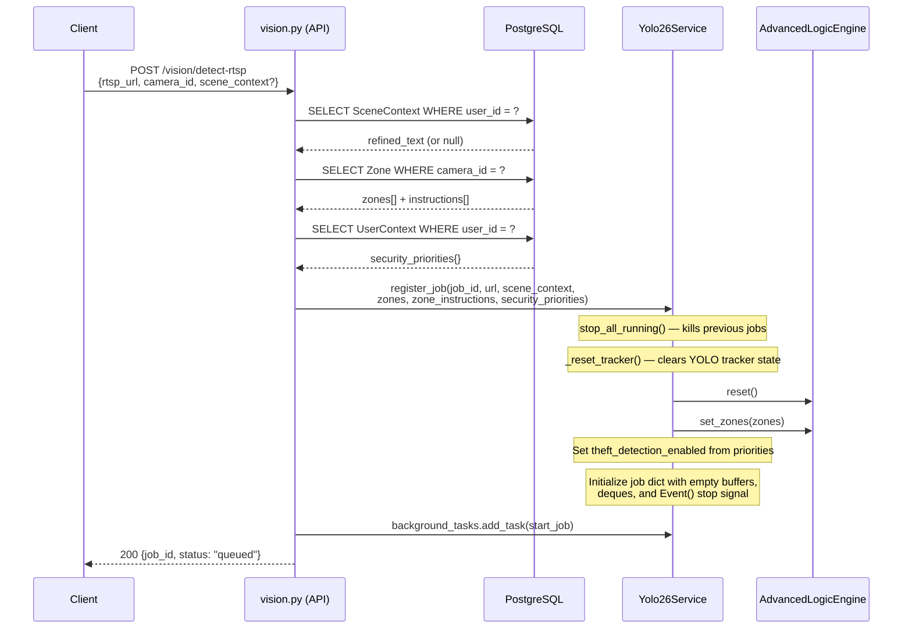
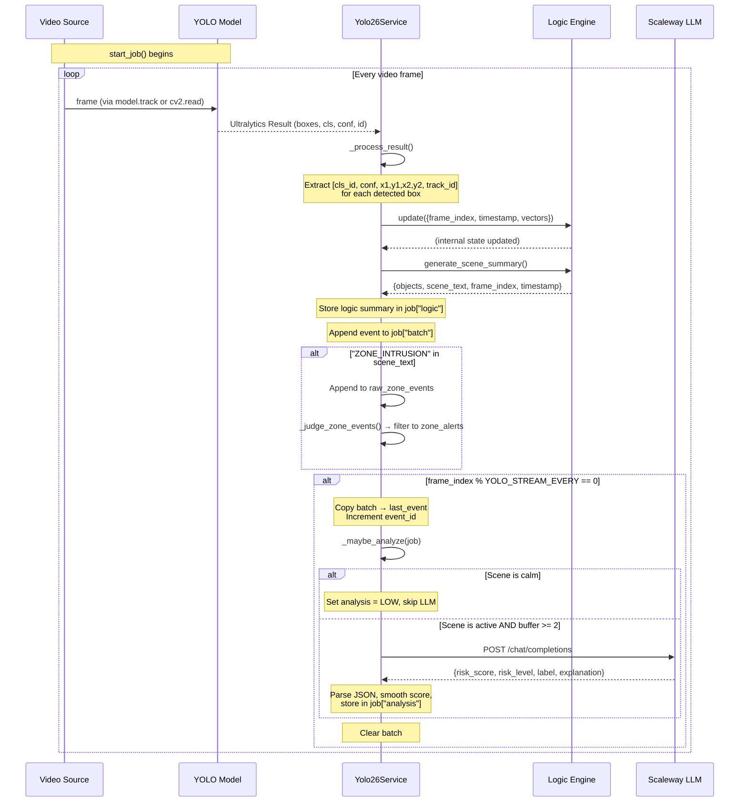
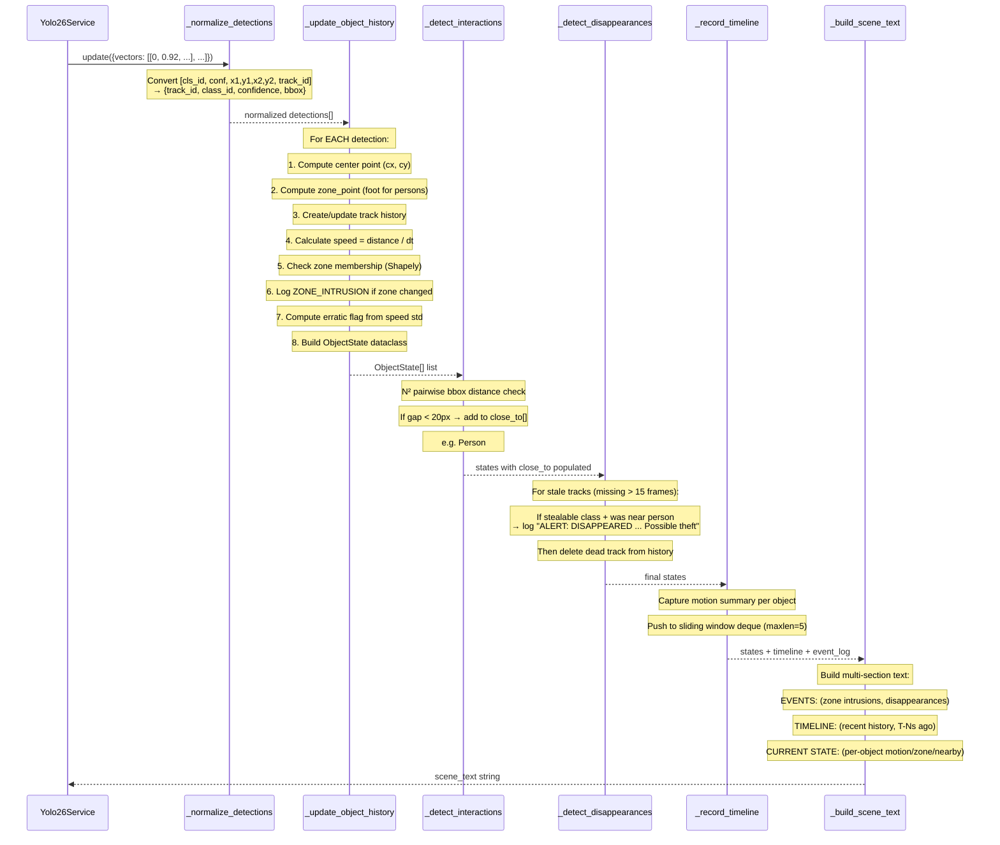
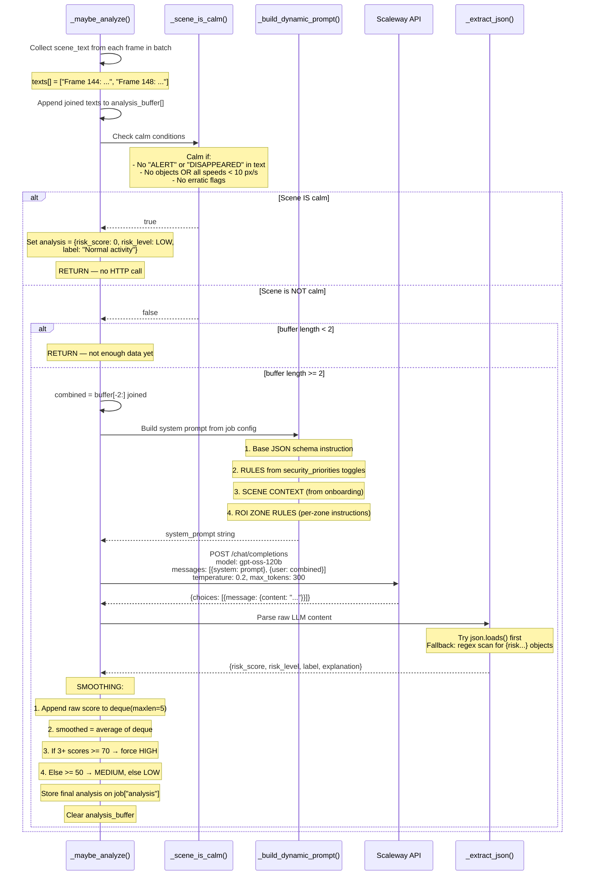
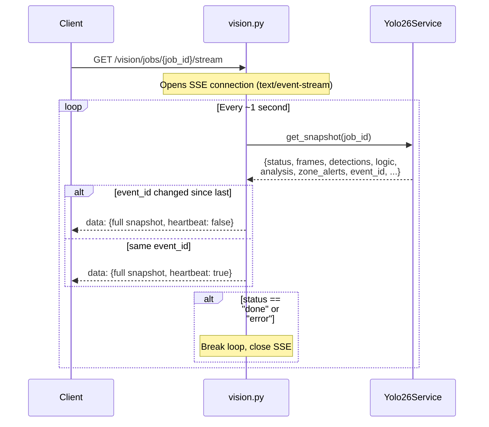
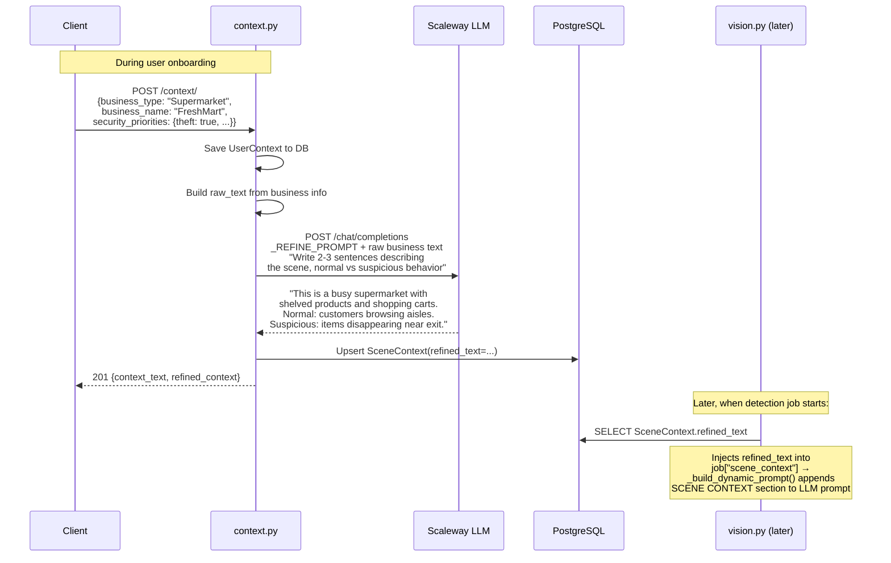

# OLEYES -- YOLO-to-LLM Pipeline: Full Technical Documentation

> **Version:** 1.0  
> **Date:** March 30, 2026  
> **Scope:** Complete architecture, data flow, and logic documentation for the connection between the YOLO object detection engine and the Scaleway LLM risk analysis system.

---

## Table of Contents

1. [System Overview](#1-system-overview)
2. [Architecture Diagram](#2-architecture-diagram)
3. [Component Inventory](#3-component-inventory)
4. [Detailed Data Flow](#4-detailed-data-flow)
5. [Sequence Diagrams](#5-sequence-diagrams)
   - 5.1 [Job Creation and Initialization](#51-job-creation-and-initialization)
   - 5.2 [Per-Frame Detection Loop](#52-per-frame-detection-loop)
   - 5.3 [Logic Engine Internal Pipeline](#53-logic-engine-internal-pipeline)
   - 5.4 [LLM Analysis Trigger and Response](#54-llm-analysis-trigger-and-response)
   - 5.5 [SSE Snapshot Delivery to Client](#55-sse-snapshot-delivery-to-client)
   - 5.6 [Context Onboarding (Indirect LLM Path)](#56-context-onboarding-indirect-llm-path)
6. [The Logic Engine -- Deep Dive](#6-the-logic-engine----deep-dive)
   - 6.1 [ObjectState Data Structure](#61-objectstate-data-structure)
   - 6.2 [Spatial Reasoning](#62-spatial-reasoning)
   - 6.3 [Interaction Detection](#63-interaction-detection)
   - 6.4 [Disappearance / Theft Heuristic](#64-disappearance--theft-heuristic)
   - 6.5 [Scene Text Generation](#65-scene-text-generation)
   - 6.6 [Timeline System](#66-timeline-system)
7. [The LLM Integration -- Deep Dive](#7-the-llm-integration----deep-dive)
   - 7.1 [Dynamic Prompt Construction](#71-dynamic-prompt-construction)
   - 7.2 [Calm Scene Optimization](#72-calm-scene-optimization)
   - 7.3 [Batching and Buffer Strategy](#73-batching-and-buffer-strategy)
   - 7.4 [Response Parsing and Score Smoothing](#74-response-parsing-and-score-smoothing)
   - 7.5 [Zone Alert Filtering](#75-zone-alert-filtering)
8. [Configuration Reference](#8-configuration-reference)
9. [Security Priority Toggles](#9-security-priority-toggles)
10. [Key Design Decisions](#10-key-design-decisions)

---

## 1. System Overview

OLEYES is an AI-powered CCTV surveillance system built on **FastAPI**. At its core, the system connects two AI layers:

| Layer | Technology | Role |
|-------|-----------|------|
| **Perception** | YOLOv26 (Ultralytics) | Real-time object detection and multi-object tracking on video streams |
| **Reasoning** | Scaleway LLM (`gpt-oss-120b`) | Interprets structured scene descriptions to produce risk assessments |

The critical insight is that **YOLO never talks directly to the LLM**. Between them sits the **AdvancedLogicEngine** -- a deterministic Python layer that transforms raw bounding-box tensors into structured natural-language scene descriptions. The LLM receives *text*, not images or tensors.

```
Video Stream ──> YOLO (detection vectors) ──> Logic Engine (scene text) ──> LLM (risk JSON)
```

This architecture means the LLM acts as a **reasoning layer over pre-structured text**, not as a vision model. All spatial analysis, tracking, zone membership, and proximity calculations happen deterministically in Python before the LLM is ever consulted.

---

## 2. Architecture Diagram

```
┌─────────────────────────────────────────────────────────────────────────┐
│                              CLIENT                                     │
│   POST /vision/detect-*  ──────────►  GET /vision/jobs/{id}/stream     │
│        (start job)                         (SSE snapshots)             │
└──────────┬──────────────────────────────────────┬───────────────────────┘
           │                                      │
           ▼                                      ▲
┌──────────────────────┐              ┌───────────────────────┐
│    vision.py (API)   │              │   SSE Event Stream    │
│  ─ load zones/DB     │              │   {logic, analysis,   │
│  ─ load priorities   │              │    zone_alerts, ...}  │
│  ─ load scene ctx    │              └───────────┬───────────┘
│  ─ register_job()    │                          │
│  ─ start_job() (bg)  │              ┌───────────┴───────────┐
└──────────┬───────────┘              │  get_snapshot(job_id)  │
           │                          └───────────┬───────────┘
           ▼                                      │
┌─────────────────────────────────────────────────┴───────────────────────┐
│                         Yolo26Service                                    │
│                                                                          │
│  ┌──────────┐    ┌───────────────┐    ┌──────────────┐    ┌───────────┐ │
│  │  YOLO26  │──►│_process_result│──►│ Logic Engine │──►│_maybe_     │ │
│  │ .track() │    │ (per frame)   │    │  .update()   │    │ analyze() │ │
│  └──────────┘    └───────────────┘    │  .summary()  │    └─────┬─────┘ │
│                                       └──────────────┘          │       │
│                                                                  │       │
│  job["logic"] = scene summary                                   │       │
│  job["analysis"] = LLM risk JSON  ◄─────────────────────────────┘       │
│  job["zone_alerts"] = filtered alerts                                   │
└─────────────────────────────────────────────────────────────────────────┘
                                                    │
                                                    ▼
                                    ┌──────────────────────────┐
                                    │   Scaleway LLM API       │
                                    │   POST /chat/completions │
                                    │   model: gpt-oss-120b    │
                                    │                          │
                                    │   IN:  scene_text (text) │
                                    │   OUT: {risk_score,      │
                                    │         risk_level,      │
                                    │         label,           │
                                    │         explanation}     │
                                    └──────────────────────────┘
```

---

## 3. Component Inventory

| File | Class / Function | Role in Pipeline |
|------|-----------------|-----------------|
| `vision.py` | `start_youtube_detection`, `start_rtsp_detection`, `start_rtmp_detection` | API entry points; load DB context, zones, priorities; register + start background job |
| `vision.py` | `stream_job_status` | SSE endpoint delivering real-time snapshots to the client |
| `vision.py` | `_load_zones`, `_load_security_priorities` | DB loaders that feed configuration into the job |
| `yolo26_service.py` | `Yolo26Service` | Orchestrator: owns YOLO model, job lifecycle, logic engine, LLM client |
| `yolo26_service.py` | `_process_result` | Per-frame bridge: extracts detections from YOLO, feeds logic engine, triggers batching |
| `yolo26_service.py` | `_maybe_analyze` | Decision gate: builds LLM prompt, calls Scaleway, parses + smooths result |
| `yolo26_service.py` | `_build_dynamic_prompt` | Constructs the system prompt from security toggles + scene context + zone rules |
| `yolo26_service.py` | `_scene_is_calm` | Short-circuit: skips LLM call when nothing interesting is happening |
| `yolo26_service.py` | `_judge_zone_events` | Filters raw zone intrusion events against user-defined zone instructions |
| `logic_engine.py` | `AdvancedLogicEngine` | Deterministic scene analysis: tracking, speed, zones, proximity, disappearance, text generation |
| `logic_engine.py` | `ObjectState` | Per-object dataclass capturing all computed attributes |
| `context.py` | `_refine_context` | Onboarding LLM call that generates `scene_context` text stored in DB |
| `config.py` | (module-level) | All YOLO and Scaleway configuration from `.env` |

---

## 4. Detailed Data Flow

The data undergoes **five transformations** from raw video to client-visible risk assessment:

### Stage 1: Video Capture to YOLO Tensors

```
Video Source (RTSP/RTMP/YouTube URL)
    │
    ▼
model.track(source=..., stream=True, persist=True)
    │
    ▼
Ultralytics Result object
    ├── result.boxes.cls    → class IDs (int tensor)
    ├── result.boxes.conf   → confidence scores (float tensor)
    ├── result.boxes.xyxy   → bounding boxes [x1, y1, x2, y2] (float tensor)
    └── result.boxes.id     → tracker IDs (int tensor, persisted across frames)
```

### Stage 2: Tensor Extraction to Detection Vectors

```python
# _process_result extracts each box into a primitive Python list:
[cls_id, confidence, x1, y1, x2, y2, track_id]
# Example: [0, 0.92, 150.5, 200.3, 320.1, 580.7, 3]
#           ^Person  ^92%   ^─── bounding box ───^  ^tracker #3
```

### Stage 3: Detection Vectors to Logic Engine State

```python
# Input to AdvancedLogicEngine.update():
{
    "frame_index": 147,
    "timestamp": 1711792800.45,
    "vectors": [
        [0, 0.92, 150.5, 200.3, 320.1, 580.7, 3],   # Person#3
        [26, 0.85, 400.0, 300.0, 450.0, 380.0, 7],   # Handbag#7
    ]
}

# Output from generate_scene_summary():
{
    "objects": [
        {
            "track_id": 3, "class_id": 0, "class_name": "Person",
            "confidence": 0.92,
            "bbox": [150.5, 200.3, 320.1, 580.7],
            "center": [235.3, 390.5],
            "speed": 45.2,
            "zone": "Entrance",
            "loiter_seconds": 12.0,
            "erratic": false,
            "close_to": ["Handbag#7"]
        },
        ...
    ],
    "scene_text": "EVENTS:\n  - ZONE_INTRUSION: Person#3 entered zone 'Entrance'.\n\nTIMELINE...\n\nCURRENT STATE:\n  Person#3: Moving (45px/s), Zone: Entrance, Loitering: 12s, Nearby: [Handbag#7]\n  Handbag#7: Stationary, Nearby: [Person#3]",
    "frame_index": 147,
    "timestamp": 1711792800.45
}
```

### Stage 4: Scene Text to LLM Risk Assessment

```
# User message sent to LLM (combined from last 2 buffer entries):
Frame 144: CURRENT STATE:
  Person#3: Moving (45px/s), Zone: Entrance, Loitering: 12s, Nearby: [Handbag#7]
  Handbag#7: Stationary, Nearby: [Person#3]

Frame 148: EVENTS:
  - ALERT: Handbag#7 DISAPPEARED while close to Person#3. Possible theft/concealment.
CURRENT STATE:
  Person#3: FAST/Running (280px/s), Erratic, Zone: Exit

# LLM response:
{"risk_score": 85, "risk_level": "HIGH", "label": "Possible bag theft", "explanation": "Handbag vanished near person who then ran towards exit."}
```

### Stage 5: Analysis Delivery to Client

```json
// SSE snapshot (GET /vision/jobs/{id}/stream):
{
    "status": "running",
    "frames": 148,
    "detections": 412,
    "event_id": 37,
    "logic": { "objects": [...], "scene_text": "..." },
    "analysis": {
        "risk_score": 78,
        "risk_score_raw": 85,
        "risk_level": "HIGH",
        "label": "Possible bag theft",
        "explanation": "Handbag vanished near person who then ran towards exit."
    },
    "zone_alerts": [
        {"type": "ZONE_INTRUSION", "message": "Person#3 entered zone 'Exit'", "frame": 148}
    ],
    "heartbeat": false
}
```

---

## 5. Sequence Diagrams

### 5.1 Job Creation and Initialization



### 5.2 Per-Frame Detection Loop



### 5.3 Logic Engine Internal Pipeline



### 5.4 LLM Analysis Trigger and Response



### 5.5 SSE Snapshot Delivery to Client



### 5.6 Context Onboarding (Indirect LLM Path)



---

## 6. The Logic Engine -- Deep Dive

The `AdvancedLogicEngine` (452 lines) is the **bridge** between raw YOLO tensors and the LLM. It is entirely **deterministic** -- no AI/ML, just spatial math and heuristics.

### 6.1 ObjectState Data Structure

Every tracked object in the current frame is represented as:

```python
@dataclass
class ObjectState:
    track_id: int          # YOLO tracker ID (persisted across frames)
    class_id: int          # COCO class ID (0=Person, 26=Handbag, etc.)
    class_name: str        # Human-readable ("Person", "Handbag")
    confidence: float      # YOLO detection confidence [0..1]
    bbox: np.ndarray       # [x1, y1, x2, y2] pixel coordinates
    center: np.ndarray     # [cx, cy] center point
    speed: float           # pixels/second (computed from frame-to-frame displacement)
    zone: str | None       # Name of the ROI zone containing this object, or None
    loiter_seconds: float  # Cumulative seconds spent in current zone
    erratic: bool          # True if speed standard deviation > 120 over last 10 frames
    close_to: list[str]    # Labels of nearby objects, e.g. ["Person#2", "Handbag#5"]
```

### 6.2 Spatial Reasoning

The engine performs three spatial computations per frame:

**a) Zone Membership** (Shapely `Polygon.contains(Point)`):
- For **persons** (class_id=0): the test point is the **foot center** `(cx, y2)` -- bottom center of the bounding box -- to better represent where a person is standing.
- For **all other objects**: the test point is the **bbox center** `(cx, cy)`.
- Zones are arbitrary polygons defined by the user in the UI (stored as JSON coordinate arrays).

**b) Speed Computation**:
```
speed = |center_current - center_previous| / delta_time
```
- `delta_time` is clamped to a minimum of `1/fps` (33ms at 30fps) to prevent division artifacts.
- The last 10 speed values are stored per track for erratic detection.

**c) Erratic Detection**:
```
erratic = (std(speed_history) > 120.0) AND (len(speed_history) >= 3)
```
A high standard deviation in speed means the object is accelerating/decelerating unpredictably, which can indicate fighting, panic, or erratic behavior.

### 6.3 Interaction Detection

An N-squared pairwise check between all objects in the current frame:

```
For each pair (i, j):
    gap = shapely.box(*bbox_i).distance(shapely.box(*bbox_j))
    if gap < 20px:
        objects[i].close_to.append("ClassName#TrackID_j")
        objects[j].close_to.append("ClassName#TrackID_i")
```

This 20-pixel threshold means bounding boxes are either overlapping or nearly touching. The `close_to` field is critical for the theft heuristic and for the LLM's understanding of object relationships.

### 6.4 Disappearance / Theft Heuristic

When a tracked object goes missing for more than 15 consecutive frames:

```
IF theft_detection_enabled:
    IF object was a "stealable" class (handbag, backpack, suitcase, laptop, phone, book):
        IF the object's last close_to list contained any Person:
            → LOG "ALERT: Handbag#7 DISAPPEARED while close to Person#3. Possible theft/concealment."
    DELETE the dead track from history
```

**Stealable COCO class IDs:** 24 (backpack), 26 (handbag), 28 (suitcase), 63 (laptop), 67 (cell phone), 73 (book).

This is a **heuristic, not a certainty**. The LLM then makes the final judgment based on the alert text combined with motion context.

### 6.5 Scene Text Generation

The `_build_scene_text()` method generates a structured text document with three sections:

```
EVENTS:
  - ZONE_INTRUSION: Person#3 entered zone 'Entrance'.
  - ALERT: Handbag#7 DISAPPEARED while close to Person#3. Possible theft/concealment.

TIMELINE (recent history):
  T-3.2s: Person#3: Moving (45px/s), near [Handbag#7]; Handbag#7: Stationary
  T-1.1s: Person#3: FAST (280px/s), Erratic; Handbag#7: Stationary

CURRENT STATE:
  Person#3: FAST/Running (280px/s), Erratic, Zone: Exit
```

**Motion labels:**
| Speed Range | Label |
|------------|-------|
| < 5 px/s | "Stationary" |
| 5--249 px/s | "Moving (Npx/s)" |
| >= 250 px/s | "FAST/Running (Npx/s)" |

**Additional tags per object:**
- `Erratic` -- speed std > 120
- `Zone: <name>` -- if inside a defined ROI polygon
- `Loitering: Ns` -- if in a zone for > 2 seconds
- `Nearby: [...]` -- from interaction detection
- `[WEAPON]` -- if class name matches weapon keywords (knife, gun, etc.)

### 6.6 Timeline System

A sliding window (`deque(maxlen=5)`) captures the last 5 significant state snapshots. Each entry contains:

```python
{
    "timestamp": 1711792800.45,
    "summary": "Person#3: Moving (45px/s), near [Handbag#7]; Handbag#7: Stationary"
}
```

When building scene text, the timeline entries are presented as relative timestamps (e.g., "T-3.2s") so the LLM can reason about temporal patterns -- was someone moving, then stopped? Did an object exist 3 seconds ago but not now?

---

## 7. The LLM Integration -- Deep Dive

### 7.1 Dynamic Prompt Construction

The system prompt is **not static**. It is rebuilt per LLM call from four sources:

**a) Base Schema (always present):**
```
You are an AI CCTV analyst. Analyze the scene data and respond ONLY with valid JSON:
{"risk_score": 0-100, "risk_level": "LOW"|"MEDIUM"|"HIGH",
 "label": "2-5 word title", "explanation": "1 sentence max 20 words"}
```

**b) Security Rules (toggled per user configuration):**

| Toggle | When Enabled | When Disabled |
|--------|-------------|---------------|
| `theft_detection` | "If a Person overlaps an Item and the Item disappears while the Person moves away, that is HIGH risk theft." | "Theft detection is DISABLED. Do NOT flag theft, concealment, or disappearing objects." |
| `violence_detection` | "If two Persons are Nearby and one has high speed, erratic movement, or fighting indicators = HIGH risk." | "Violence detection is DISABLED. Do NOT flag fighting or aggression." |
| `person_fall_detection` | "If a Person's bounding box suddenly changes from tall/narrow to wide/short, or speed drops to 0 after fast movement, flag as possible fall." | *(rule omitted)* |
| `fire_detection` | "If fire, smoke, or flames are detected = HIGH risk." | *(rule omitted)* |
| `customer_behavior_analytics` | "Note customer flow patterns, dwell times, and crowding. Normal customer movement is LOW risk." | *(rule omitted)* |

If **no toggles** are enabled, a catch-all rule is added:
> "GENERAL: Monitor for unusual activity. Normal movement of people and objects is LOW risk."

**c) Scene Context (from onboarding):**
```
SCENE CONTEXT:
This is a busy supermarket with shelved products and shopping carts. Normal behavior
is customers browsing aisles. Suspicious activity includes items disappearing near exit.
```

**d) Zone Instructions (per-zone user text):**
```
ROI ZONE RULES:
- Zone "Entrance": Alert when person enters after hours
- Zone "Cash Register": Monitor for loitering > 30s
```

### 7.2 Calm Scene Optimization

Before any LLM call, `_scene_is_calm()` checks:

1. No "ALERT" or "DISAPPEARED" keywords in scene_text
2. No objects detected, OR all object speeds < 10 px/s
3. No erratic flags on any object

If calm → **skip the LLM call entirely** and set:
```json
{"risk_score": 0, "risk_level": "LOW", "label": "Normal activity",
 "explanation": "Scene is calm, no significant movement detected."}
```

This is a critical **cost and latency optimization**. Most CCTV frames are boring -- the LLM only runs when the scene demands it.

### 7.3 Batching and Buffer Strategy

```
Frame 1  ─┐
Frame 2   ├── batch (accumulated in job["batch"])
Frame 3   │
Frame 4  ─┘─── Every YOLO_STREAM_EVERY (default: 4) frames:
                 1. Copy batch → last_event
                 2. Extract scene_text from each frame
                 3. Join as "Frame N: <text>" lines
                 4. Append to analysis_buffer[]
                 5. Call _maybe_analyze()
                 6. Clear batch

Inside _maybe_analyze():
    - Requires buffer length >= 2 (at least 2 batch entries)
    - Combines the LAST 2 buffer entries into the user message
    - On success: clears the entire buffer
    - On failure: sets MEDIUM fallback, clears buffer
```

This means the LLM sees approximately 8 frames of context (2 batches x 4 frames) per call. The buffer acts as a simple accumulator that ensures the LLM has enough temporal context.

### 7.4 Response Parsing and Score Smoothing

**Parsing** (`_extract_json`):
1. Try `json.loads(full_text)` -- works if LLM returns clean JSON
2. Fallback: regex scan for `{...}` blocks, check for "risk" key or "label" key
3. If nothing found → use MEDIUM fallback

**Score Smoothing** (rolling average over last 5 scores):
```
risk_scores = deque(maxlen=5)
risk_scores.append(raw_score)
smoothed = sum(risk_scores) / len(risk_scores)

if (count of scores >= 70) >= 3:
    level = "HIGH"
elif smoothed >= 50:
    level = "MEDIUM"
else:
    level = "LOW"
```

This prevents single-frame spikes from causing false HIGH alerts. The system needs **sustained** high scores to escalate.

### 7.5 Zone Alert Filtering

Raw zone intrusion events from the logic engine are filtered through `_judge_zone_events()` before reaching the client:

```
IF no zone instructions defined:
    → PASS all events (every zone entry is an alert)
ELSE:
    → Match the detected object type against keywords in the instruction text
    → e.g. instruction "alert when person enters" + event "Person#3 entered zone 'X'"
         → keyword "person" found in instruction AND event → MATCH → alert
    → Generic triggers ("any", "all", "everything") match all events
```

The keyword dictionary maps object types to synonyms:
- "person" → person, people, someone, human, man, woman, child, enter, entered
- "car" → car, vehicle, automobile
- etc.

Alerts are capped at 50 (oldest are evicted).

---

## 8. Configuration Reference

| Variable | Default | Role |
|----------|---------|------|
| `YOLO_MODEL` | `yolo26n.pt` | YOLO model weights file |
| `YOLO_DEVICE` | `cpu` | Inference device (cpu/cuda) |
| `YOLO_CONF` | `0.25` | Minimum detection confidence threshold |
| `YOLO_MAX_DETECTIONS` | `100` | Max detections per frame |
| `YOLO_STREAM_EVERY` | `4` | Frames between LLM batch triggers |
| `YOLO_VID_STRIDE` | `1` | Process every Nth frame (1 = all frames) |
| `SCALWAY_ANALYSIS_MODEL` | `gpt-oss-120b` | LLM model for risk analysis |
| `SCALWAY_ANALYSIS_MAX_TOKENS` | `300` | Max response tokens |
| `SCALWAY_ANALYSIS_TEMPERATURE` | `0.2` | Low temperature for consistent JSON output |
| `SCALWAY_ANALYSIS_TOP_P` | `0.8` | Nucleus sampling parameter |
| `SCALWAY_ANALYSIS_PRESENCE_PENALTY` | `0.0` | No presence penalty |
| `SCALWAY_TIMEOUT` | `30` | HTTP timeout in seconds |

---

## 9. Security Priority Toggles

These booleans are stored per-user in `UserContext` and loaded from the database when a detection job starts. They control **both** the logic engine behavior and the LLM prompt rules:

| Toggle | Logic Engine Effect | LLM Prompt Effect |
|--------|-------------------|-------------------|
| `theft_detection` | Enables/disables the disappearance + theft alert heuristic in `_detect_disappearances()` | Adds/removes theft detection rule in system prompt |
| `violence_detection` | *(no direct logic engine effect)* | Adds/removes violence detection rule |
| `person_fall_detection` | *(no direct logic engine effect)* | Adds/removes fall detection rule |
| `fire_detection` | *(no direct logic engine effect)* | Adds/removes fire detection rule |
| `customer_behavior_analytics` | *(no direct logic engine effect)* | Adds/removes analytics rule |

Note: `violence_detection`, `person_fall_detection`, and `fire_detection` are **entirely LLM-interpreted**. The logic engine provides the raw data (speed, erratic, bbox dimensions) but does not itself detect these events. The LLM must reason about them from the scene text.

---

## 10. Key Design Decisions

### Why text between YOLO and LLM, not images?

The LLM (`gpt-oss-120b`) is a **text-only** model hosted on Scaleway. By converting detections to structured text, the system:
- Avoids the cost and latency of vision-language models
- Maintains deterministic spatial analysis (zones, proximity, speed)
- Enables precise prompt engineering with toggleable rules
- Keeps the LLM focused on risk reasoning, not object detection

### Why a "calm scene" shortcut?

Most CCTV frames show nothing interesting. Calling the LLM for every batch would be wasteful and slow. The calm detection skips HTTP calls when all objects are slow-moving and no alerts exist, reducing API costs and keeping latency low for active events.

### Why score smoothing?

LLMs can be inconsistent between calls. A single frame might get scored 80 (HIGH) while the next identical scene gets 40 (LOW). The 5-frame rolling average with a "3 consecutive highs" threshold ensures:
- No single-frame false positives
- Sustained threats are reliably escalated
- Gradual transitions between risk levels

### Why deterministic logic before the LLM?

The logic engine provides **guarantees** that the LLM cannot:
- Zone membership is geometrically exact (Shapely polygons)
- Speed is physically computed from pixel displacement
- Disappearance detection follows explicit rules
- Proximity is measured, not guessed

The LLM's job is to **interpret** these facts in context, not to discover them.

### Why synchronous HTTP for the LLM (not async)?

`Yolo26Service` runs YOLO in a **background thread** (via `BackgroundTasks`). The `_maybe_analyze` call happens inside this thread. Using a synchronous `httpx.Client` is correct here because the detection loop is already off the async event loop. This avoids the complexity of bridging async/sync boundaries.

---

*End of documentation.*
